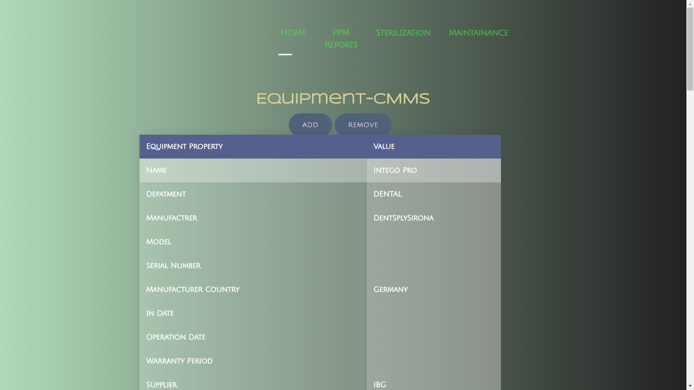
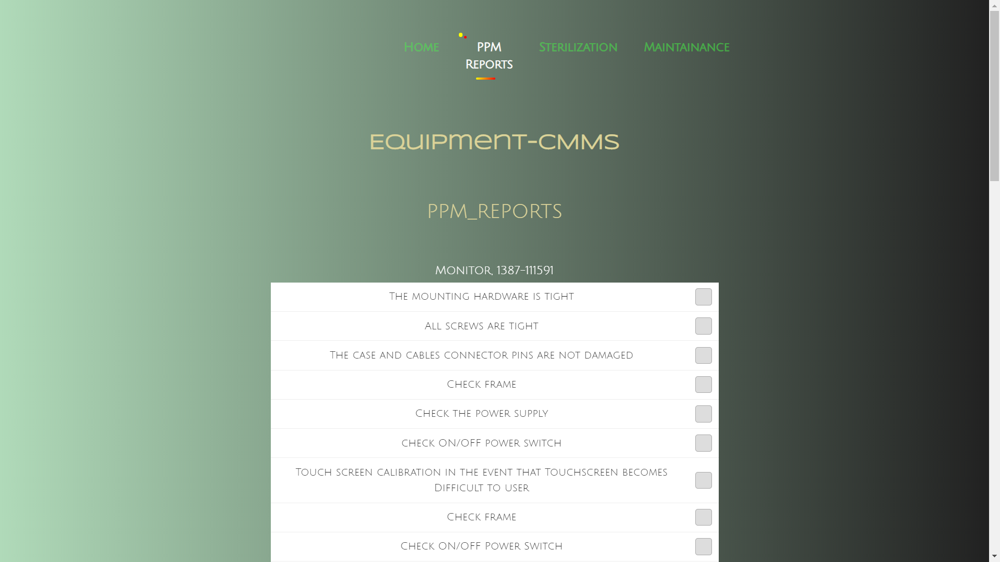

# **Clinical final project**

## Team members

- **Name** : Mahmoud Abd Elmonem Abd Elgawwad | **Sec** : 2  | **B.N** : 26 | **Email** : hooodamonem111@gmail.com
- **Name** : Adel Refat Ali | **Sec** : 2 | **B.N** : 3 | **Email** : adel.elmala2025@gmail.com
- **Name** : Ahmed Nabil Salem| **Sec** :1 | **B.N** : 10 | **Email** :ahmednaza7@gmail.com 
- **Name** : kirolos Dawood Soliman | **Sec** : 2 | **B.N** : 15 | **Email** : kirolosdawood88@gmail.com
- **Name** : Ahmed Osama Mohamed | **Sec** : 1 | **B.N** : 2 | **Email** : ahmedosamam.negm@gmail.com
- **Name** : Bishoy Magdi | **Sec** : 1 | **B.N** : 24 | **Email** : bishoymagdi626@gmail.com

# Brief overview
**CMMMS Database site that stores data related to medical equipments in Cardiac, Catherter and Dental departments and reports there sterilization and maintenance info. and hosts ppm reports online for more convenience and instant feedback to the system.**

# Project UI

## Landing page interface
**Choose a department out of the three (Cardiac/Dental/Catheter)**

  
### _Inside every department there are 3 panes_
## 1- Department equipments pane
**You can review the available equipment.**

- #### For cardiac depart.
 
- #### For dental depart.
 
 - #### For catheter depart.
 

**And you can _Add_ new Equipments to the existing ones.** 
#### 1- add Equipment data

#### 2- Submit it

#### 3- verifying the result

#### 4- Equipment added Successfully

 
 
 
 
 ## 2- PPM Reports
 **Fill the PPM report for each Equipment and write any notes along with the report**
 - #### For cardiac depart.
 
- #### For dental depart.
 
 - #### For catheter depart.
 

 ## 3- Sterilization Reports
 **Fill the  sterilization report for each Equipment and write any notes along with the report**
 - #### For cardiac depart.
 
- #### For dental depart.
 
 - #### For catheter depart.
 

 ## 4- maintenance pane 
 **The PPM and sterilization reports are proccessed and a brief and concise output is stored and displayed in the maintenance pane of the corresponding department**
 